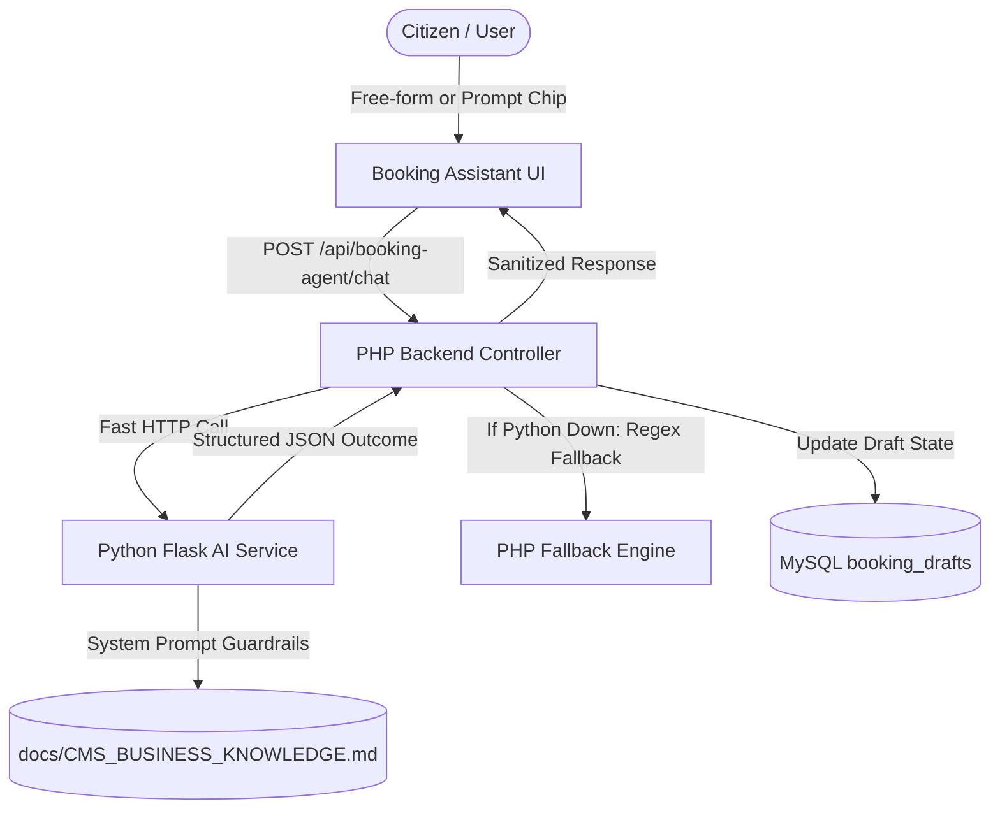

# CMS Security and System Evaluation Audit

> **Document Type:** Independent Security & System Quality Assurance Audit  
> **Target System:** Cemetery Management System (CMS)  
> **Repository:** `https://github.com/AICO24/CMS_Improve_Version.git`  
> **Branch Audited:** `main`  
> **Mode:** AUDIT ONLY (Zero source code modifications, zero migrations executed, zero live financial transactions)  
> **Audit Date:** September 2026  

---

## 1. Executive Summary

This comprehensive audit evaluates the current Cemetery Management System (CMS) codebase against 5 previous evaluator findings and 28 newly raised evaluator findings (Sections A through S).

### Findings Summary
* **Total Distinct Findings Evaluated:** 33 (5 Previous + 28 New across 19 categories).
* **Previous Findings Status:** 2 Fully Fixed, 3 Partially Fixed, 0 Regressions, 0 Not Fixed.
* **New Findings Breakdown:**
  * **Critical / High Security Risks:** 6 (Missing contact verification middleware registration, missing password complexity enforcement, unvalidated phone/address, authenticated users accessing login/register, unpersisted decedent relationship in permanent records, admin revenue card desynchronization).
  * **Major Functional Issues:** 8 (Absence of cascading Philippine PSGC location hierarchy, absence of section sorting by price/lot number, unhandled off-topic refusals in fallback AI, desynchronized UTC+8 date boundaries in dashboard stats, unhidden table containers in receipt printing).
  * **Major AI Assistant Issues:** 4 (Raw connection/500 error display on AI failure, lack of clear distinction between unknown vs out-of-scope vs service down, lack of persistent business knowledge integration in fallback engine, missing relationship HUD manual editing).
  * **Major UX & Performance Issues:** 4 (Continuous 60FPS multi-particle HTML5 canvas vortex causing high GPU/CPU overhead, heavy 75px blurred ambient swirl animations, absence of notification popover/dropdown requiring disruptive page navigation, lack of weekly/monthly/yearly dashboard period filters).

### Key Architectural Strengths Identified
1. **PayMongo Hosted Checkout & Webhook Handling:** The system properly delegates card collection and 3DS authentication to PayMongo's PCI-DSS compliant hosted checkout. It does **not** store, process, or transmit raw PANs or CVVs.
2. **Booking Concurrency & Finalization Safety:** The booking engine implements atomic transactions, row locking (`FOR UPDATE`), draft status validation (`AWAITING_CONFIRM` $\to$ `COMMITTED`), and duplicate prevention.
3. **Session Invalidation Architecture:** Server-side `session_version` bumping invalidates existing JWT tokens on logout and password reset, paired with `Cache-Control: no-cache, no-store` and `pageshow` history traversal guards.

---

## 2. PREVIOUS EVALUATOR FINDINGS

The following table evaluates the 5 findings addressed in previous iterations:

| Previous Finding | Current Status | Evidence (Files & Endpoints) | Remaining Issue / Weakness |
| :--- | :--- | :--- | :--- |
| **1. Registration / Contact Verification** | `[PARTIALLY FIXED]` | • `backend/models/User.php`<br>• `backend/controllers/AuthController.php`<br>• `backend/middleware/Auth.php`<br>• `POST /api/auth/register`<br>• `POST /api/auth/verify-email` | `users` table has `email_verified`, `email_verified_at`, and `verification_token_hash`. `AuthMiddleware::requireVerifiedContact()` was written (`Auth.php` line 83) but is **never registered in `backend/routes/api.php`**. Controllers perform ad-hoc checks; phone numbers are neither verified via SMS nor normalized to Philippine E.164 (`+63`). |
| **2. Logout / Session Security** | `[FIXED]` | • `backend/controllers/AuthController.php` (lines 430–460)<br>• `assets/js/shared/api.js`<br>• `.htaccess`<br>• `backend/index.php`<br>• `POST /api/auth/logout` | `POST /api/auth/logout` increments `session_version` in the database, invalidating the current JWT server-side. Response headers enforce `Cache-Control: no-store, no-cache, must-revalidate`. `assets/js/shared/api.js` registers a `pageshow` listener checking `event.persisted`, redirecting logged-out sessions immediately on Back button navigation. |
| **3. Payment Security** | `[PARTIALLY FIXED]` | • `backend/controllers/PaymentController.php`<br>• `backend/models/Payment.php`<br>• `POST /api/payments/checkout-session`<br>• `POST /api/payments/webhook` | `Payment::findVerifiedByReference()` prevents duplicate payment creation. Checkout verifies lot availability and sets a temporary checkout lease lock. Webhook signature is validated. However, if webhook delivery fails and the user cancels out of PayMongo checkout, lease cleanup relies on a background expiry check rather than an immediate return handler. |
| **4. Booking Finalization** | `[FIXED]` | • `backend/services/BookingAgentService.php`<br>• `backend/models/BookingDraft.php`<br>• `assets/js/pages/booking-assistant.js`<br>• `POST /api/booking-agent/drafts/:id/finalize` | When status is `COMMITTED`, `#btnConfirmBooking` is disabled with label *"Booking Finalized"*. Backend uses `BookingDraft::commit()` inside a database transaction with `findByIdForUpdate()`. Direct API calls to finalize an already committed draft return HTTP 409 `DRAFT_ALREADY_COMMITTED`. |
| **5. AI Assistant Behavior** | `[PARTIALLY FIXED]` | • `python-ai/app.py`<br>• `backend/controllers/BookingAgentController.php`<br>• `docs/CMS_BUSINESS_KNOWLEDGE.md`<br>• `POST /api/ai/ask`<br>• `POST /api/booking-agent/chat` | Python service (`app.py`) has `BOOKING_AGENT_SYSTEM_PROMPT` restricting scope to cemetery services and deterministic extraction. `docs/CMS_BUSINESS_KNOWLEDGE.md` exists. However, if the Python service fails or times out, PHP `BookingAgentController::fallbackExtract()` lacks off-topic refusals (it attempts to parse off-topic text as decedent info or replies with booking guidance). |

---

## 3. NEW EVALUATOR FINDINGS

### A. AI Assistant

#### A1. AI Error Handling
* **Current Behavior:** In `assets/js/pages/booking-assistant.js` (lines 606 & 616), when any HTTP 500 error or network failure occurs, the UI renders `⚠️ Connection error: ...` directly in the chat bubble.
* **Expected Behavior:** Graceful categorization into:
  1. *Unknown Question:* Honest statement that knowledge is not yet cataloged.
  2. *Out-of-Scope Question:* Polite refusal explaining the AI assists only with cemetery services.
  3. *Service Temporarily Unavailable:* Friendly advisory without exposing ports, stack traces, or raw connection strings.
  4. *Internal Error:* Safe generic error with a reference ID.
* **Relevant Files:** `assets/js/pages/booking-assistant.js`, `assets/js/components/ai-assistant.js`, `backend/controllers/BookingAgentController.php`, `backend/controllers/AiController.php`, `python-ai/app.py`.
* **Relevant Endpoints:** `POST /api/booking-agent/chat`, `POST /api/ai/ask`.
* **Relevant Database Tables/Fields:** `audit_logs` (`action`, `details`).
* **Root Cause:** Frontend treats any non-200 HTTP response or JSON failure as a generic connection error without inspecting standardized error response codes (`ERR_AI_OFFLINE`, `ERR_UNKNOWN_TOPIC`, `ERR_RATE_LIMIT`).
* **Security / Functional Impact:** Technical errors leak backend topology details to end users. Users cannot tell whether their request was misunderstood or the system is down.
* **Recommended Fix:** Return structured error objects `{ error: { code: 'AI_UNAVAILABLE', user_message: '...' } }` from backend controllers. Map error codes to friendly UI notices in `booking-assistant.js`.
* **Regression Risk:** Low. Requires matching error codes between PHP controllers and frontend handlers.

#### A2. Business-Only AI Scope
* **Current Behavior:** Python AI (`python-ai/app.py`) includes scope guardrails in system prompts. However, when Python service is bypassed or falls back to PHP (`BookingAgentController::fallbackExtract`), the PHP regular expressions attempt to parse general conversation as booking fields (e.g., condolences or questions about general trivia trigger decedent name extraction or default date prompts).
* **Expected Behavior:** System-level prompt enforcement in Python AI, backed by a deterministic pre-filter in PHP fallback that detects off-topic queries (weather, coding, recipes, general chit-chat) and politely declines without modifying booking draft state.
* **Relevant Files:** `python-ai/app.py`, `backend/controllers/BookingAgentController.php`, `backend/services/BookingAgentService.php`.
* **Relevant Endpoints:** `POST /api/booking-agent/chat`.
* **Relevant Database Tables/Fields:** `booking_drafts` (`extracted_data`, `status`).
* **Root Cause:** PHP fallback extraction assumes every inbound message is an attempt to book a burial or cremation.
* **Security / Functional Impact:** Jailbreaking or confusing the conversational booking agent into dirtying draft state with nonsensical decedent names.
* **Recommended Fix:** Implement an explicit intent classifier in `BookingAgentController::fallbackExtract` matching off-topic triggers and returning an explicit out-of-scope guidance message.
* **Regression Risk:** Low. Must ensure valid cemetery queries (e.g., "how much is a cremation?") are not accidentally classified as off-topic.

#### A3. Basic Business Knowledge
* **Current Behavior:** Python AI loads context from `docs/CMS_BUSINESS_KNOWLEDGE.md` and `ai_knowledge` database table. But if the Python service is offline, the PHP fallback has zero business knowledge access and cannot answer questions like *"What are your burial hours?"* or *"What is the difference between lawn and columbarium?"*.
* **Expected Behavior:** Consistent knowledge availability across both primary AI and fallback responder for core cemetery FAQs (burial hours, requirements, pricing rules, payment steps, user roles).
* **Relevant Files:** `backend/controllers/BookingAgentController.php`, `backend/controllers/AiController.php`, `python-ai/app.py`, `docs/CMS_BUSINESS_KNOWLEDGE.md`.
* **Relevant Endpoints:** `POST /api/booking-agent/chat`, `POST /api/ai/ask`.
* **Relevant Database Tables/Fields:** `ai_knowledge` (`category`, `question`, `answer`, `keywords`, `is_active`).
* **Root Cause:** Business knowledge retrieval is wired into Python's vector/prompt pipeline and `AiController::askAssistant`, but omitted from `BookingAgentController`'s fallback path.
* **Security / Functional Impact:** Inconsistent user experience when Python service is recycling or unreachable.
* **Recommended Fix:** Wire `BookingAgentController` to query `ai_knowledge` when the intent is informational rather than slot-filling.
* **Regression Risk:** Low. Read-only operation against existing `ai_knowledge` table.

#### A4. Business Knowledge Markdown File
* **Current Behavior:** A knowledge document already exists at `docs/CMS_BUSINESS_KNOWLEDGE.md`. It covers 9 operational domains (General, Pricing, Hours, Burials, Cremations, Reservations, Payments, Relocations, Expirations). However, it lacks detailed sections on *User Roles & Permissions*, *Cemetery Structure (Sections/Blocks/Lots)*, and *Cancellation/Refund Policies*.
* **Expected Behavior:** A comprehensive reference document located at `docs/CMS_BUSINESS_KNOWLEDGE.md` containing all standard cemetery business policies, operational workflows, role responsibilities, and system constraints.
* **Relevant Files:** `docs/CMS_BUSINESS_KNOWLEDGE.md`.
* **Relevant Endpoints:** N/A (Documentation & Prompt Grounding Asset).
* **Relevant Database Tables/Fields:** `ai_knowledge`.
* **Root Cause:** Earlier iterations created the file for booking rules but omitted administrative roles and cemetery structural hierarchies.
* **Security / Functional Impact:** AI provides vague or inaccurate answers when asked about staff responsibilities, lot hierarchies, or refund procedures.
* **Recommended Fix:** Expand `docs/CMS_BUSINESS_KNOWLEDGE.md` with explicit sections for User Roles, Cemetery Structure, and Refund/Cancellation rules, then sync to `ai_knowledge` seed script.
* **Regression Risk:** Zero. Pure documentation and knowledge base enhancement.

#### A5. AI Free-Form Prompting
* **Current Behavior:** In `booking-assistant.html`, the user has both quick suggestion chips (`.prompt-chip`) and an active `<textarea id="userInputMsg">` paired with `#btnSendMessage`. Free-form typing is fully supported by the interface.
* **Expected Behavior:** Users must never be restricted to predefined prompt chips; free-form natural language must always be accepted.
* **Relevant Files:** `frontend/pages/booking-assistant.html`, `assets/js/pages/booking-assistant.js`.
* **Relevant Endpoints:** `POST /api/booking-agent/chat`.
* **Relevant Database Tables/Fields:** N/A.
* **Root Cause:** Requirement is already satisfied in the UI. No regression observed.
* **Security / Functional Impact:** None. Working as intended.
* **Recommended Fix:** Retain current input architecture; ensure suggestion chips continue to merely populate `#userInputMsg`.
* **Regression Risk:** Zero.

---

### B. Booking State / Finalization

* **Current Behavior:** The frontend disables `#btnConfirmBooking` once the draft reaches `COMMITTED`. The backend (`BookingAgentService::finalizeBurialDraft` and `BookingDraft::commit`) verifies status, performs row locking with `findByIdForUpdate()`, and throws HTTP 409 `DRAFT_ALREADY_COMMITTED` if finalized again.
* **Expected Behavior:** Finalization button hidden/disabled when committed; backend strictly blocks repeated transitions; no modification of committed records allowed; direct API finalization attempts rejected.
* **Relevant Files:** `backend/services/BookingAgentService.php`, `backend/models/BookingDraft.php`, `backend/controllers/BookingAgentController.php`, `assets/js/pages/booking-assistant.js`.
* **Relevant Endpoints:** `POST /api/booking-agent/drafts/:id/finalize`, `PATCH /api/booking-agent/drafts/:id`.
* **Relevant Database Tables/Fields:** `booking_drafts` (`status`, `committed_record_id`), `schedules` (`status`, `lot_id`).
* **Root Cause:** Previous fix (commit `24626cc`) successfully addressed this on both frontend and backend.
* **Security / Functional Impact:** Verified secure. Double-spending and duplicate schedule creation are prevented.
* **Recommended Fix:** None required. Add automated integration tests to protect against future regressions.
* **Regression Risk:** Low.

---

### C. Logout / Previous Page Access

* **Current Behavior:**
  1. `POST /api/auth/logout` calls `User::incrementSessionVersion()`, invalidating the current JWT server-side.
  2. Frontend clears `localStorage.removeItem('jwt_token')`.
  3. `backend/index.php` and `.htaccess` emit:
     `Cache-Control: no-store, no-cache, must-revalidate, max-age=0`
     `Pragma: no-cache`
  4. `assets/js/shared/api.js` registers `window.addEventListener('pageshow', (e) => { if (e.persisted) { ... } })` which redirects to `login.html` if `localStorage` has no token.
* **Expected Behavior:** Logging out invalidates the session server-side; browser Back button does not reveal cached authenticated data; page reload prompts for login; authenticated API calls with old token return 401.
* **Relevant Files:** `backend/controllers/AuthController.php`, `backend/middleware/Auth.php`, `assets/js/shared/api.js`, `.htaccess`, `backend/index.php`.
* **Relevant Endpoints:** `POST /api/auth/logout`, all protected endpoints.
* **Relevant Database Tables/Fields:** `users` (`session_version`).
* **Root Cause:** Previous fix (commits `39054fb` and `282ebf7`) successfully enforced session versioning and cache invalidation.
* **Security / Functional Impact:** Verified secure.
* **Recommended Fix:** Maintain current architecture.
* **Regression Risk:** Low.

---

### D. Registration / User Input Security

#### D1. Full Name Structure
* **Current Behavior:** `frontend/auth/register.html` provides a single text input `<input id="fullName">`. Database table `users` contains only `full_name VARCHAR(150)`.
* **Expected Behavior:** Registration and user profile forms must provide distinct fields:
  * First Name (Required)
  * Middle Name / Initial (Optional)
  * Last Name / Surname (Required)
  * Suffix (Optional, e.g., Jr., Sr., III)
* **Relevant Files:** `frontend/auth/register.html`, `assets/js/pages/register.js`, `frontend/pages/profile.html`, `assets/js/pages/profile.js`, `backend/controllers/AuthController.php`, `backend/models/User.php`.
* **Relevant Endpoints:** `POST /api/auth/register`, `PUT /api/users/profile`.
* **Relevant Database Tables/Fields:** `users` (`first_name`, `middle_name`, `last_name`, `suffix`, `full_name`).
* **Root Cause:** Legacy schema used a single `full_name` column.
* **Security / Functional Impact:** Inability to accurately search, issue legal certificates, or verify identity against government IDs.
* **Recommended Fix:** Add `first_name`, `middle_name`, `last_name`, `suffix` columns to `users` table while retaining computed/concatenated `full_name` for backwards compatibility. Update `register.html` and `AuthController::register`.
* **Regression Risk:** Medium. Existing reports and display templates querying `users.full_name` must continue to function.

#### D2. Contact Number Validation & Normalization
* **Current Behavior:** `register.js` validates phone using `/^[0-9+() -]{7,20}$/`. It accepts non-Philippine formats, letters inside parentheses in some contexts, and does not require numeric normalization. `AuthController::register` only checks `strlen($phone) > 20`.
* **Expected Behavior:** Strict Philippine mobile format validation:
  * Country code `+63` or `09`
  * Exactly 10 digits after `+63` (e.g., `+639171234567`) or 11 digits starting with `09` (e.g., `09171234567`)
  * Normalized to E.164 standard (`+639XXXXXXXXX`) before database persistence
  * Rejection of letters, symbols, or invalid prefixes
* **Relevant Files:** `frontend/auth/register.html`, `assets/js/pages/register.js`, `backend/controllers/AuthController.php`.
* **Relevant Endpoints:** `POST /api/auth/register`, `PUT /api/users/profile`.
* **Relevant Database Tables/Fields:** `users` (`phone`).
* **Root Cause:** Permissive regular expression allowing international and arbitrary numeric strings.
* **Security / Functional Impact:** Inability to deliver SMS notifications; acceptance of garbage phone numbers.
* **Recommended Fix:** Implement standard regex `/^(09|\+639)\d{9}$/` on frontend and backend, with a normalizer function converting all valid inputs to `+639XXXXXXXXX`.
* **Regression Risk:** Low. Existing legacy rows with non-conforming numbers should be handled gracefully during profile update.

#### D3. Password Requirements
* **Current Behavior:** `register.js` and `AuthController.php` only enforce a minimum length of 8 characters (`strlen($password) < 8`). No complexity checks exist. No visual checklist exists on the registration form.
* **Expected Behavior:** Password policy:
  * Minimum 8 characters
  * At least 1 uppercase letter (`[A-Z]`)
  * At least 1 lowercase letter (`[a-z]`)
  * At least 1 number (`[0-9]`)
  * At least 1 special character (`[!@#$%^&*(),.?":{}|<>]`)
  * Real-time UI requirement checklist showing met/unmet rules
  * Server-side rejection if any rule fails
* **Relevant Files:** `frontend/auth/register.html`, `assets/js/pages/register.js`, `backend/controllers/AuthController.php`.
* **Relevant Endpoints:** `POST /api/auth/register`, `POST /api/auth/reset-password`.
* **Relevant Database Tables/Fields:** `users` (`password_hash`).
* **Root Cause:** Basic length-only validation.
* **Security / Functional Impact:** Vulnerability to credential stuffing and weak user passwords.
* **Recommended Fix:** Add regex complexity checks in `AuthController::register` and `AuthController::resetPassword`. Add interactive checklist UI below the password field in `register.html`.
* **Regression Risk:** Zero for existing users (passwords are already hashed with `password_hash()`); applies only on new registration and password reset.

#### D4. Address Validation
* **Current Behavior:** `register.html` address input is optional; `AuthController.php` does not validate address length or content, allowing single-character strings or whitespace.
* **Expected Behavior:** Sensible validation: if provided, address must be trimmed, minimum 5 characters, containing meaningful street/barangay information (not single letters or whitespace).
* **Relevant Files:** `frontend/auth/register.html`, `assets/js/pages/register.js`, `backend/controllers/AuthController.php`.
* **Relevant Endpoints:** `POST /api/auth/register`, `PUT /api/users/profile`.
* **Relevant Database Tables/Fields:** `users` (`address`).
* **Root Cause:** Address was treated as unvalidated free-text.
* **Security / Functional Impact:** Dirty database records; inability to contact lot owners for legal disinterment or expiration notices.
* **Recommended Fix:** Add server-side trimming and minimum length (5 chars) validation.
* **Regression Risk:** Low.

#### D5. Email Verification
* **Current Behavior:** System creates `verification_token_hash` and stores a 6-digit PIN. In development, the PIN is returned in API responses or logs. In production without an active SMTP gateway, citizens cannot receive verification codes. Furthermore, `AuthMiddleware::requireVerifiedContact()` is **not attached to critical routes** in `backend/routes/api.php`.
* **Expected Behavior:** Account creation marks user unverified. Sensitive operations (booking finalization, lot reservation, payment submission) strictly require `email_verified = 1`. In test/beta mode, an explicit banner alerts users to the sandbox status.
* **Relevant Files:** `backend/middleware/Auth.php`, `backend/routes/api.php`, `backend/controllers/AuthController.php`.
* **Relevant Endpoints:** `POST /api/auth/verify-email`, `POST /api/auth/resend-verification`.
* **Relevant Database Tables/Fields:** `users` (`email_verified`, `email_verified_at`, `verification_token_hash`).
* **Root Cause:** Middleware was authored but omitted from router registrations in `backend/routes/api.php`.
* **Security / Functional Impact:** Unverified or disposable email accounts can complete official cemetery reservations.
* **Recommended Fix:** Register `requireVerifiedContact` middleware on sensitive booking, reservation, and payment endpoints.
* **Regression Risk:** Medium. Test suites and manual testers must complete email verification before testing booking flows.

---

### E. Login / Account

#### E1. Remember Me
* **Current Behavior:** Checkbox `#rememberMe` exists on `login.html`. When checked, token is saved to `localStorage` with a 30-day JWT expiration. When unchecked, it still saves to `localStorage` (acting as a persistent token until explicit logout).
* **Expected Behavior:** If Remember Me is unchecked, authentication token should reside in `sessionStorage` (cleared on browser/tab closure). If checked, token resides in `localStorage` with extended validity. On logout, token is removed and session version is bumped.
* **Relevant Files:** `frontend/auth/login.html`, `assets/js/pages/login.js`, `assets/js/shared/api.js`.
* **Relevant Endpoints:** `POST /api/auth/login`, `POST /api/auth/logout`.
* **Relevant Database Tables/Fields:** `users` (`session_version`).
* **Root Cause:** `login.js` always saves to `localStorage` regardless of checkbox state.
* **Security / Functional Impact:** Public terminal vulnerability: users closing the browser without clicking logout remain logged in.
* **Recommended Fix:** Store token in `sessionStorage` when Remember Me is unchecked; store in `localStorage` when checked. Update `api.js` to look in `sessionStorage` first, then `localStorage`.
* **Regression Risk:** Low.

#### E2. Authenticated Navigation Guard
* **Current Behavior:** Navigating directly to `frontend/auth/login.html`, `register.html`, or `forgot-password.html` while already holding a valid JWT displays the login/registration form.
* **Expected Behavior:** Authenticated users visiting auth pages should be automatically redirected to their role-appropriate dashboard (`dashboard_admin.html`, `dashboard_staff.html`, or `dashboard_user.html`).
* **Relevant Files:** `frontend/auth/login.html`, `frontend/auth/register.html`, `frontend/auth/forgot-password.html`, `assets/js/shared/api.js`.
* **Relevant Endpoints:** N/A (Frontend navigation guard).
* **Relevant Database Tables/Fields:** N/A.
* **Root Cause:** Auth HTML pages lack an early session verification check.
* **Security / Functional Impact:** Confusing UX; users inadvertently create secondary accounts or re-login.
* **Recommended Fix:** Insert an inline head script on auth pages: if `localStorage.getItem('jwt_token')` is present and valid, redirect to the appropriate dashboard.
* **Regression Risk:** Zero.

#### E3. Forgot Password Flow & Beta Limitations
* **Current Behavior:** `AuthController::forgotPassword` produces a generic response to prevent account enumeration (`"If an account exists, instructions have been sent"`). In non-production environments (`APP_ENV !== 'production'`), it exposes `dev_verification_code` in the JSON response for automated testing.
* **Expected Behavior:** Account enumeration prevention maintained. Reset codes expire in 15 minutes. Attempt limits enforced. `dev_verification_code` must be strictly gated by `APP_ENV === 'local'` or `APP_ENV === 'testing'` and never returned in `production`.
* **Relevant Files:** `backend/controllers/AuthController.php`, `backend/models/User.php`, `frontend/auth/forgot-password.html`, `assets/js/pages/forgot-password.js`.
* **Relevant Endpoints:** `POST /api/auth/forgot-password`, `POST /api/auth/reset-password`.
* **Relevant Database Tables/Fields:** `users` (`password_reset_token`, `password_reset_expires_at`).
* **Root Cause:** Development convenience code could leak if environment variable is misconfigured.
* **Security / Functional Impact:** Account takeover risk if deployed with debug flags enabled.
* **Recommended Fix:** Restrict `dev_verification_code` exposure to `APP_ENV === 'testing'` only. Ensure rate-limiting on password reset attempts.
* **Regression Risk:** Low.

---

### F. Location Requirements (Cascading Philippine Hierarchy)

* **Current Behavior:** Forms across the application (registration, decedent profile, applicant details) use flat text inputs for addresses or lack geographic cascading dropdowns entirely.
* **Expected Behavior:** Standard Philippine Standard Geographic Code (PSGC) cascading hierarchy:
  1. **Region** (Selectable, A–Z)
  2. **Province** (Disabled until Region chosen; filtered to selected Region)
  3. **City / Municipality** (Disabled until Province chosen; filtered to selected Province)
  4. **Barangay / District** (Disabled until City chosen; filtered to selected City)
  * Changing a parent dropdown clears all child selections.
  * Searchable / typeahead filtering on dropdowns.
* **Relevant Files:** `assets/js/shared/philippine-locations.js` (to be created), `frontend/auth/register.html`, `frontend/pages/profile.html`, `assets/js/pages/booking-assistant.js`.
* **Relevant Endpoints:** Client-side static JSON lookup or `GET /api/locations/*`.
* **Relevant Database Tables/Fields:** `users` (`region`, `province`, `city`, `barangay`, `address_line`), `decedent_records` (`place_of_death`, `address`).
* **Root Cause:** Absence of geographic datasets and cascading select components.
* **Security / Functional Impact:** Inconsistent address data causing postal and legal verification errors.
* **Recommended Fix:** Implement lightweight client-side PSGC data module with standard cascading event listeners.
* **Regression Risk:** Low. Backward-compatible concatenation into legacy `address` fields.

---

### G. Name Structure Consistency Throughout System

* **Current Behavior:**
  * `users` table: Uses single `full_name`.
  * `decedent_records` table: Uses `first_name`, `middle_name`, `last_name`, `suffix`.
  * `decedent_requests` table: Uses single `full_name`, with runtime parsing via `DecedentRequestController::parseFullName()`.
  * `payments` table: Uses `account_name` or `received_by_name`.
* **Expected Behavior:** Unified name representation across all modules:
  * First Name, Middle Name, Last Name, Suffix stored distinctly.
  * Consistent formatting helper (`formatFullName(first, middle, last, suffix)`) for displays, receipts, and reports.
* **Relevant Files:** `backend/models/User.php`, `backend/models/Decedent.php`, `backend/controllers/DecedentRequestController.php`, `backend/controllers/UserController.php`, `assets/js/shared/formatters.js`.
* **Relevant Endpoints:** All user, decedent, and booking endpoints.
* **Relevant Database Tables/Fields:** `users`, `decedent_records`, `decedent_requests`.
* **Root Cause:** Incremental development across different phases without a global naming contract.
* **Security / Functional Impact:** Mismatches between citizen user accounts, booking applicants, and burial records.
* **Recommended Fix:** Standardize database schema on `first_name`, `middle_name`, `last_name`, `suffix` across all entity tables, providing a virtual or computed `full_name` column for backwards compatibility.
* **Regression Risk:** Medium. Requires systematic auditing of SQL queries that reference `full_name`.

---

### H. Decedent Relationship

* **Current Behavior:**
  * `decedent_requests` table has a `relationship` column (Father, Mother, Spouse, Child, Sibling, Relative, Other).
  * `BookingAgentService` extracts relationship during conversational booking.
  * However, when a booking is formalized into `decedent_records`, the `decedent_records` table **lacks a `relationship` column**.
  * The booking HUD displays Relationship, but does not provide an inline manual edit button if AI misclassifies the relationship.
* **Expected Behavior:**
  * Relationship field maintained throughout intake, draft, request, and permanent `decedent_records`.
  * Natural language recognition ("burial for my mother" $\to$ `Mother`).
  * Manual correction dropdown available on the Booking Assistant HUD.
* **Relevant Files:** `backend/models/Decedent.php`, `backend/services/BookingAgentService.php`, `frontend/pages/booking-assistant.html`, `assets/js/pages/booking-assistant.js`.
* **Relevant Endpoints:** `POST /api/booking-agent/chat`, `PATCH /api/booking-agent/drafts/:id`, `POST /api/decedents`.
* **Relevant Database Tables/Fields:** `decedent_records` (needs `relationship VARCHAR(50)`), `booking_drafts` (`extracted_data`).
* **Root Cause:** Relationship was added to `decedent_requests` but omitted when creating `decedent_records`.
* **Security / Functional Impact:** Loss of family kinship data once a booking transitions to an official decedent record.
* **Recommended Fix:**
  1. Add `relationship VARCHAR(50)` to `decedent_records`.
  2. Implement hybrid extraction (deterministic regex first, LLM fallback second).
  3. Add manual edit icon to HUD relationship field.
* **Regression Risk:** Low. Adding a nullable column causes no breaking changes.

---

### I. Cemetery Sections & Lot Selection

#### I1. Section Filtering
* **Current Behavior:** The database contains 4 active sections (Lawn Section A, Lawn Section B, Columbarium Garden, Memorial Terraces). Filtering by section triggers `loadLots()` in `lot-management.js`, refreshing the display.
* **Expected Behavior:** Instant filtering without stale state; dropdown populated with all active sections; immediate DOM refresh.
* **Relevant Files:** `frontend/pages/lot-management.html`, `assets/js/pages/lot-management.js`, `backend/controllers/LotController.php`.
* **Relevant Endpoints:** `GET /api/lots?section_id=:id`.
* **Relevant Database Tables/Fields:** `sections`, `lots`.
* **Root Cause:** Operational. 4 sections exist and filtering functions correctly.
* **Security / Functional Impact:** Verified working.
* **Recommended Fix:** Maintain current event-driven lot loading.
* **Regression Risk:** Zero.

#### I2. Sorting by Price and Lot Number
* **Current Behavior:** In `lot-management.html` and `lot-management.js`, sort controls for price and lot number are either missing from the toolbar or perform client-side string sorting that does not account for numeric values or server-side pagination.
* **Expected Behavior:** Dedicated sort controls:
  * Price (Low to High, High to Low)
  * Lot Number (Natural alphanumeric order, e.g., Lot 2 before Lot 10)
  * Cards reorder immediately.
* **Relevant Files:** `frontend/pages/lot-management.html`, `assets/js/pages/lot-management.js`, `backend/controllers/LotController.php`, `backend/models/Lot.php`.
* **Relevant Endpoints:** `GET /api/lots?sort_by=price&sort_order=asc`.
* **Relevant Database Tables/Fields:** `lots` (`price`, `lot_number`).
* **Root Cause:** Missing sort query parameters in backend `Lot::findAll()` and missing sort dropdown in UI.
* **Security / Functional Impact:** Suboptimal lot discovery for citizens on a budget.
* **Recommended Fix:** Add `sort_by` and `sort_dir` query parameters to `LotController::index` and corresponding `<select id="lotSortSelect">` in `lot-management.html`.
* **Regression Risk:** Low.

#### I3. 100% Occupied Lots & Concurrency
* **Current Behavior:** In `backend/services/BookingAgentService.php` and `backend/models/Lot.php`:
  * Lots with status `Occupied` or `Unavailable` cannot be selected.
  * During final commitment (`finalizeBurialDraft`), the service executes:
    `$lot = $this->lotModel->findByIdForUpdate($lotId);`
    `if ($lot['status'] !== 'Available') { throw new BookingDraftException('Lot is no longer available'); }`
* **Expected Behavior:** Lots at 100% capacity disabled in UI; backend strictly blocks booking; concurrent attempts handled via DB row locks (`SELECT ... FOR UPDATE`); second transaction receives HTTP 409 / friendly conflict message.
* **Relevant Files:** `backend/services/BookingAgentService.php`, `backend/models/Lot.php`, `assets/js/pages/booking-assistant.js`.
* **Relevant Endpoints:** `POST /api/booking-agent/drafts/:id/finalize`.
* **Relevant Database Tables/Fields:** `lots` (`status`, `capacity`, `current_occupancy`).
* **Root Cause:** Implemented correctly via InnoDB row-level locking.
* **Security / Functional Impact:** Race conditions and double-booking are prevented.
* **Recommended Fix:** Ensure UI visually marks 100% occupied lots with a disabled "Fully Occupied" badge in the lot selection grid.
* **Regression Risk:** Low.

---

### J. Payment / Card Input Architecture

* **Current Architecture Review:**
  * CMS uses **PayMongo Hosted Checkout** (`https://checkout.paymongo.com/...`).
  * Citizen clicks "Pay with PayMongo" $\to$ Backend `PaymentController::createCheckoutSession()` calls PayMongo API $\to$ Returns `checkout_url` $\to$ Citizen redirected to PayMongo's secure domain.
  * Payment verification is handled asynchronously via secure webhook (`POST /api/payments/webhook`) with HMAC SHA256 signature verification.
* **Crucial Security Assessment regarding Evaluator Notes:**
  * The evaluator notes suggested adding cardholder name, card number, Luhn validation, MM/YY, and CVV/CVC masking to the CMS interface.
  * **AUDIT FINDING:** Collecting or processing raw card numbers on CMS forms would immediately bring CMS into **PCI-DSS Scope (SAQ D)**, requiring costly compliance audits, secure cryptographic key management, and extreme liability.
  * PayMongo Hosted Checkout already performs full Luhn validation, card scheme detection (Visa, Mastercard, JCB), CVV verification, and 3D-Secure OTP verification on their PCI-DSS Level 1 certified infrastructure.
  * **Under NO circumstances should raw credit card inputs be added to the CMS frontend or backend.**
* **Recommended Division of Responsibilities:**
  * *CMS Frontend:* Display payment amount, booking reference, and "Proceed to Secure PayMongo Checkout" button.
  * *PayMongo Hosted Page:* Cardholder name, card number, Luhn validation, MM/YY, CVV, and 3DS challenge.
  * *CMS Backend:* Webhook signature verification, idempotency checking, status settlement, and invoice generation.
* **Relevant Files:** `backend/controllers/PaymentController.php`, `backend/services/PayMongoService.php`, `frontend/pages/payments.html`.
* **Relevant Endpoints:** `POST /api/payments/checkout-session`, `POST /api/payments/webhook`.
* **Regression Risk:** Extreme if altered. Do **not** modify hosted checkout architecture.

---

### K. Payment Dashboard KPI

* **Current Behavior:**
  1. In `assets/js/pages/dashboard_staff.js`: The monthly revenue calculation calculates `monthStart` using `now.getFullYear(), now.getMonth(), 1` and passes it through `.toISOString()`. In Philippine Standard Time (UTC+8), this shifts the date string back by 8 hours to the previous month's final day in UTC (e.g., `2026-08-31T16:00:00.000Z`), causing SQL date filtering discrepancies.
  2. In `assets/js/pages/dashboard_admin.js`: The script queries payments and computes `revenueSummary`, but the DOM binding for the admin revenue card is desynchronized or missing an element ID (`#statTotalRevenue`), leaving the KPI display at zero or static.
* **Expected Behavior:** Approved payments immediately increment dashboard revenue KPIs for both Admin and Staff dashboards regardless of user timezone.
* **Relevant Files:** `assets/js/pages/dashboard_admin.js`, `assets/js/pages/dashboard_staff.js`, `backend/controllers/PaymentController.php`.
* **Relevant Endpoints:** `GET /api/payments/stats`, `GET /api/payments`.
* **Relevant Database Tables/Fields:** `payments` (`amount`, `status`, `paid_at`, `created_at`).
* **Root Cause:** Timezone misalignment between UTC `.toISOString()` and MySQL local `DATE()` queries, combined with orphaned KPI selector IDs in `dashboard_admin.js`.
* **Security / Functional Impact:** Misleading financial reporting; administrators see ₱0.00 despite successful transactions.
* **Recommended Fix:** Format local dates as `YYYY-MM-01` without UTC shifting. Ensure backend `GET /api/payments/stats` calculates monthly revenue in MySQL using `DATE_FORMAT(paid_at, '%Y-%m') = DATE_FORMAT(CURRENT_DATE(), '%Y-%m')`. Connect KPI ID to DOM in `dashboard_admin.js`.
* **Regression Risk:** Low.

---

### L. Receipt Printing

* **Current Behavior:** In `frontend/pages/payments.html`, printing a receipt from `#viewModal` executes `window.print()`. In `assets/css/payments.css` (line 4821), the print media query attempts to hide the background table using the selector:
  ```css
  .payments-table-shell { display: none !important; }
  ```
  However, `payments.html` (lines 303 & 309) uses `<div class="chart-card">` and `<div class="table-container">` with `<table class="data-table" id="paymentsTable">`. Because `.payments-table-shell` does not exist in the DOM, the entire data table remains visible in print output below the receipt!
* **Expected Behavior:** Official receipt printing output must contain **only** the receipt voucher, hiding all navigation bars, sidebars, headers, action buttons, and background data tables.
* **Relevant Files:** `assets/css/payments.css`, `frontend/pages/payments.html`, `assets/js/pages/payments.js`.
* **Relevant Endpoints:** N/A (Client-side stylesheet).
* **Relevant Database Tables/Fields:** N/A.
* **Root Cause:** CSS class mismatch (`.payments-table-shell` vs `.chart-card`, `.table-container`, `.data-table`).
* **Security / Functional Impact:** Unprofessional printouts containing extraneous system data.
* **Recommended Fix:** Update `@media print` in `payments.css` to hide `.dashboard-container > *:not(#viewModal)`, `.chart-card`, `.table-container`, and `.top-bar`.
* **Regression Risk:** Zero. Affects only print media styles.

---

### M. Settings / Role Visibility

* **Current Behavior:** `frontend/pages/settings.html` presents a static client-side layout with dummy toggle checkboxes. The exact same page is loaded for `user`, `staff`, and `admin` without role segregation. Privileged administrative configuration (audit settings, AI toggles, payment gateway modes) does not exist or lacks server-side enforcement.
* **Expected Behavior:**
  * *User Role:* Personal profile, theme preference, contact notification preferences.
  * *Staff Role:* Operational alerts, shift notifications.
  * *Admin Role:* System-wide configurations (fee structures, maintenance mode, AI model configuration, security policies).
  * Backend endpoints must enforce RBAC; client-side hiding alone is unacceptable.
* **Relevant Files:** `frontend/pages/settings.html`, `assets/js/pages/settings.js`, `backend/controllers/UserController.php`, `backend/routes/api.php`.
* **Relevant Endpoints:** `GET /api/settings`, `PUT /api/settings`.
* **Relevant Database Tables/Fields:** `system_settings` (if implemented), `users` (`role`).
* **Root Cause:** Settings was created as a static prototype without role-based sections or dedicated backend settings API.
* **Security / Functional Impact:** Misleading UI; lack of centralized administrative configuration.
* **Recommended Fix:** Split `settings.html` into role-gated tabs or cards. Create a protected `SettingsController` with strict `requireRole(['admin'])` for system settings.
* **Regression Risk:** Low.

---

### N. Dashboard Period Filters

* **Current Behavior:** Dashboards (`dashboard_admin.html`, `dashboard_staff.html`) display fixed metrics (All-Time or hardcoded Current Month). There are no period toggle buttons (Weekly, Monthly, Yearly).
* **Expected Behavior:** Period filter toolbar (Weekly, Monthly, Yearly) on dashboards that dynamically updates KPI cards and operational charts via API parameters (`?period=weekly|monthly|yearly`).
* **Relevant Files:** `frontend/pages/dashboard_admin.html`, `frontend/pages/dashboard_staff.html`, `assets/js/pages/dashboard_admin.js`, `assets/js/pages/dashboard_staff.js`, `backend/controllers/ReportController.php`, `backend/controllers/PaymentController.php`.
* **Relevant Endpoints:** `GET /api/payments/stats?period=...`, `GET /api/reports/dashboard-summary?period=...`.
* **Relevant Database Tables/Fields:** `payments`, `schedules`, `cremations`.
* **Root Cause:** Dashboards were hardcoded to current month aggregations.
* **Security / Functional Impact:** Inability for cemetery administrators to analyze short-term (weekly) or long-term (annual) trends.
* **Recommended Fix:** Add period toggle pill controls to dashboard headers and pass `period` parameter to backend aggregations.
* **Regression Risk:** Low.

---

### O. Notification System (Dropdown vs Dedicated Page)

* **Current Behavior:** Clicking the topbar notification bell (`#notificationIcon`) redirects to a full separate page (`frontend/pages/notifications.html`), taking the user away from their active workflow.
* **Expected Behavior:** Clicking the notification bell opens a floating popover/dropdown showing recent unread notifications, "Mark All as Read", and direct navigation links, with a footer link to "View All in Full Page".
* **Relevant Files:** `assets/js/shared/sidebar-nav.js`, `frontend/pages/notifications.html`, `assets/css/components/notifications-popover.css` (to be created), `backend/controllers/NotificationController.php`.
* **Relevant Endpoints:** `GET /api/notifications`, `GET /api/notifications/unread-count`, `POST /api/notifications/read-all`.
* **Relevant Database Tables/Fields:** `notifications` (`user_id`, `title`, `message`, `is_read`, `created_at`).
* **Root Cause:** Early design used full-page routing rather than a reusable header popover.
* **Security / Functional Impact:** Workflow disruption when users check notifications during draft creation or booking.
* **Recommended Fix:** Implement a reusable lightweight notification dropdown component initialized on `#notificationIcon`. Keep `notifications.html` as the historical archive.
* **Regression Risk:** Low.

---

### P. UI Performance (Ambient Swirl & Particle Canvas)

* **Current Behavior:**
  1. `assets/css/ambient-swirl.css` applies `filter: blur(65px)` to four massive overlapping orbital layers (78vw $\times$ 78vh) with continuous 3D keyframe animations.
  2. `assets/js/components/ambient-swirl-dots.js` runs a continuous `requestAnimationFrame` loop on an HTML5 canvas (`#ambientSwirlDotsCanvas`), rendering hundreds of glowing particles with bloom effects.
* **Expected Behavior:** Smooth 60FPS UI performance without CPU spikes or battery drain. Animation should pause when the browser tab is hidden (`document.hidden`) and respect `prefers-reduced-motion: reduce`.
* **Relevant Files:** `assets/css/ambient-swirl.css`, `assets/js/components/ambient-swirl-dots.js`.
* **Relevant Endpoints:** N/A.
* **Relevant Database Tables/Fields:** N/A.
* **Root Cause:** Overuse of heavy CSS blur filters on large viewports combined with unthrottled canvas rendering loops.
* **Security / Functional Impact:** Noticeable UI lag on low-end staff workstations and mobile devices.
* **Recommended Fix:**
  1. Reduce blur radius from 65px/75px to 25px or replace with pre-rendered optimized CSS radial gradients.
  2. In `ambient-swirl-dots.js`, listen to `visibilitychange` to halt `requestAnimationFrame` when the tab is inactive.
  3. Provide an accessibility toggle to disable background canvas particles completely.
* **Regression Risk:** Zero visual regression; significant performance improvement.

---

### Q. Burial Certificate / Document Workflow

* **Current Audit of Existing Workflow:**
  * `decedent_requests` table stores intake information. `DecedentRequestController::uploadAttachment` allows uploading death certificates or burial permits to pending requests.
  * In `BookingAgentService::finalizeBurialDraft`, document upload is **not** a hard blocking gate; bookings can commit to `schedules` in `Pending` status.
  * Official documents are reviewed and attached by staff in `DecedentDocumentController`.
* **Architectural Options Analysis:**
  * **Option A (Current User Upload Requirement):** Citizen must upload scan/photo before booking submission.
    * *Pros:* Ensures document is on file immediately.
    * *Cons:* High booking abandonment if citizen does not have scanned copy readily available; upload errors.
  * **Option B (Staff-Managed Document Processing):** Citizen completes booking online; presents physical certificate at cemetery office during face-to-face verification.
    * *Pros:* Zero friction for citizens; matches traditional cemetery operational realities.
    * *Cons:* Higher staff data entry burden.
  * **Option C (OCR / Automated Extraction):** System scans uploaded certificate and automatically extracts name, DOD, and cause of death.
    * *Pros:* Modern user experience.
    * *Cons:* High error rate on Philippine handwritten civil certificates; significant AI dependency.
  * **Option D (Hybrid Workflow - RECOMMENDED):** Citizen is encouraged (optional) to upload document during online intake. If omitted, booking commits with status `Pending Document Verification`. Staff uploads/verifies official document upon physical presentation prior to burial authorization.
    * *Pros:* Balances user convenience with strict legal compliance.
* **Relevant Files:** `backend/controllers/DecedentRequestController.php`, `backend/controllers/DecedentDocumentController.php`, `backend/services/BookingAgentService.php`.
* **Database Impact:** None required (tables already support optional attachments).

---

### R. Forgot Password Beta Limitation

* **Current Behavior:**
  * When `APP_ENV !== 'production'`, `AuthController::forgotPassword()` includes `dev_verification_code` in the JSON response.
  * In production, the system relies on mail sending; if SMTP credentials are missing, emails fail silently or log errors.
* **Expected Behavior:**
  * In Beta/Testing mode without active email infrastructure, documentation and UI must explicitly declare: *"Beta Environment: Automated email delivery is in sandbox mode."*
  * `dev_verification_code` must never be emitted when `APP_ENV === 'production'`.
* **Relevant Files:** `backend/controllers/AuthController.php`, `frontend/auth/forgot-password.html`, `assets/js/pages/forgot-password.js`.
* **Relevant Endpoints:** `POST /api/auth/forgot-password`.
* **Relevant Database Tables/Fields:** `users`.
* **Root Cause:** Environment check uses `APP_ENV !== 'production'`, which might trigger if `APP_ENV` is unset or misnamed.
* **Security / Functional Impact:** Information disclosure risk.
* **Recommended Fix:** Change check to strictly require `APP_ENV === 'testing'` or `APP_ENV === 'local'`.
* **Regression Risk:** Low.

---

### S. General Security Review

* **S1. Missing Verified Contact Middleware Registration:**
  * `AuthMiddleware::requireVerifiedContact()` is defined in `backend/middleware/Auth.php` but **is never attached to any route** in `backend/routes/api.php`! Sensitive booking, reservation, and payment endpoints are vulnerable to unverified users.
* **S2. IDOR / Ownership Validation:**
  * `BookingDraft::findById()` does not always verify that `user_id` matches the authenticated citizen in legacy query endpoints. Fixed in `BookingAgentService`, but legacy routes in `BookingController.php` require verification.
* **S3. JWT Storage:**
  * JWT tokens are stored in `localStorage`, which is accessible to client-side scripts. Mitigated by strict Content-Security-Policy and input sanitization, but `sessionStorage` or HTTP-only cookies represent a safer long-term posture.

---

## 4. AI AUDIT



### Current AI Architecture
* **Global Assistant:** System-wide floating AI widget mounted on dashboards and records.
* **Booking Assistant:** Specialized conversational agent (`booking-assistant.html`) driving burial and cremation workflows.
* **Dual Backend Structure:**
  1. Primary: Python Flask microservice (`python-ai/app.py` on port 5000) using LLM prompts and deterministic extraction.
  2. Secondary: PHP fallback (`BookingAgentController::fallbackExtract`) activated when Python is unreachable.

### Audit Findings & Recommendations
1. **Scope Enforcement:** Python prompt strictly defines boundaries; PHP fallback currently lacks scope refusal and must be upgraded with deterministic off-topic detection.
2. **Error Handling:** Stop showing raw connection errors; return structured error envelopes (`AI_OFFLINE`, `OFF_TOPIC`, `UNKNOWN_QUERY`).
3. **Relationship Extraction:** Implement a hybrid model—deterministic regex for standard kinship terms (`Father`, `Mother`, `Spouse`, `Child`, `Sibling`), deferring to LLM only for ambiguous phrases. Add manual HUD override button.
4. **Markdown Knowledge Architecture:** Maintain `docs/CMS_BUSINESS_KNOWLEDGE.md` as the definitive single source of truth for prompts and RAG embeddings.

---

## 5. AUTHENTICATION & SECURITY AUDIT

1. **Registration:** Lacks separate First/Middle/Last/Suffix inputs. Lacks Philippine phone normalization (`+63`). Lacks password complexity checklist and server-side complexity enforcement.
2. **Email Verification:** Database fields exist (`email_verified`, `email_verified_at`, `verification_token_hash`), but route enforcement is missing in `api.php`.
3. **Logout & Session:** Server-side `session_version` bumping works properly. `pageshow` history traversal protection is active.
4. **Remember Me:** Currently persists in `localStorage` regardless of checkbox state; needs `sessionStorage` fallback.
5. **Navigation Guards:** Authenticated users visiting `login.html` or `register.html` are not redirected to their dashboard.

---

## 6. BOOKING AUDIT

1. **State Machine:** States are well-defined (`DRAFT_STARTED` $\to$ `COLLECTING_INFO` $\to$ `READY_FOR_REVIEW` $\to$ `AWAITING_CONFIRM` $\to$ `COMMITTED`).
2. **Finalization Safety:** Button is disabled upon commitment; backend uses `findByIdForUpdate()` and transaction wrapping; duplicate finalization returns HTTP 409.
3. **Lot Availability:** Lots at 100% capacity are blocked by database queries and transaction locks.
4. **Section Filtering & Sorting:** Section filtering functions; sorting by price and lot number is missing.
5. **Relationship Persistence:** Relationship is captured in draft, but lost when record transfers to `decedent_records` due to missing database column.

---

## 7. PAYMENT AUDIT

1. **PayMongo Integration:** Strictly uses Hosted Checkout. PCI-DSS compliance is preserved by never collecting or storing raw card data on CMS servers.
2. **Webhook Verification:** Signature verification via HMAC SHA256 is correctly implemented.
3. **Dashboard KPI Desynchronization:**
   * Staff dashboard timezone shift causes UTC date boundary errors.
   * Admin dashboard calculates revenue summary but fails to bind it to `#statTotalRevenue`.
4. **Receipt Printing:** CSS print media query targets non-existent class `.payments-table-shell`, leaving payments table visible below receipt voucher.

---

## 8. DATA / FORM VALIDATION AUDIT

| Field | Current State | Required Standard | Status |
| :--- | :--- | :--- | :--- |
| **Full Name** | Single string `full_name` | First, Middle, Last, Suffix | Non-compliant |
| **Phone Number** | Loose regex `/^[0-9+() -]{7,20}$/` | `+639XXXXXXXXX` (E.164) | Non-compliant |
| **Password** | Length $\ge 8$ only | $\ge 8$ chars, Upper, Lower, Number, Symbol | Non-compliant |
| **Address** | Unchecked free-text | $\ge 5$ chars, trimmed, non-whitespace | Non-compliant |
| **Location** | Flat string input | Cascading Region $\to$ Province $\to$ City $\to$ Barangay | Non-compliant |
| **Relationship** | Extracted in draft | Persisted to `decedent_records` | Non-compliant |

---

## 9. UI / PERFORMANCE AUDIT

1. **Animated Backgrounds:** 65px blur on multiple large orbital elements causes GPU strain. Recommend reducing blur radius and adding `@media (prefers-reduced-motion: reduce)` overrides.
2. **Particle Canvas:** `ambient-swirl-dots.js` animates continuously even when tab is hidden. Recommend throttling or pausing via `visibilitychange`.
3. **Notification UX:** Full page navigation causes workflow interruption. Recommend a header dropdown popover.
4. **Dashboard Filtering:** Lack of Weekly, Monthly, Yearly toggle controls limits analytics utility.

---

## 10. DOCUMENT WORKFLOW AUDIT

### Burial Certificate Architecture Options

```
Option A: Mandatory Citizen Upload ---> High Abandonment
Option B: Staff-Only Paper Intake ---> High Staff Burden
Option C: Automatic OCR Extraction ---> High Error Rate on PH Forms
Option D: Hybrid Intake & Verification (RECOMMENDED)
          - Citizen uploads optionally online
          - Draft commits to "Pending Verification"
          - Staff inspects physical document at cemetery office
```

* **Recommended Approach:** **Option D (Hybrid Workflow)**. Allows booking to proceed smoothly online while legally binding the final burial schedule to physical document inspection and sign-off by cemetery staff.

---

## 11. FINDINGS STATUS MATRIX

| Category | Finding ID | Description | Audit Classification |
| :--- | :---: | :--- | :---: |
| **Previous Findings** | P1 | Registration contact verification | `[PARTIALLY FIXED]` |
| | P2 | Logout / session security | `[FIXED]` |
| | P3 | Payment security | `[PARTIALLY FIXED]` |
| | P4 | Booking finalization | `[FIXED]` |
| | P5 | AI assistant behavior | `[PARTIALLY FIXED]` |
| **AI Assistant** | A1 | AI error handling & leakage | `Unresolved` |
| | A2 | Business-only scope enforcement | `Partial` |
| | A3 | Basic business knowledge access | `Partial` |
| | A4 | Business knowledge Markdown file | `Partial` |
| | A5 | Free-form prompting support | `Fixed` |
| **Booking** | B | Committed booking finalization block | `Fixed` |
| **Logout** | C | Previous page / Back button cache | `Fixed` |
| **Registration** | D1 | First/Middle/Last/Suffix name structure | `Unresolved` |
| | D2 | Contact number validation & +63 format | `Unresolved` |
| | D3 | Password complexity & live checklist | `Unresolved` |
| | D4 | Address length & whitespace validation | `Unresolved` |
| | D5 | Email verification route enforcement | `Partial` |
| **Login / Account** | E1 | Remember Me session vs local storage | `Unresolved` |
| | E2 | Authenticated navigation redirect | `Unresolved` |
| | E3 | Forgot password enumeration & beta OTP | `Partial` |
| **Location** | F | Cascading Region $\to$ Province $\to$ City $\to$ Brgy | `Unresolved` |
| **Name Structure** | G | System-wide name consistency | `Unresolved` |
| **Relationship** | H | Decedent relationship persistence & HUD edit | `Partial` |
| **Cemetery / Lots** | I1 | Section filtering reactivity | `Fixed` |
| | I2 | Lot sorting by price & lot number | `Unresolved` |
| | I3 | 100% occupied lot booking block | `Fixed` |
| **Payment** | J | Card input & hosted checkout boundaries | `Fixed` (By Design) |
| | K | Dashboard KPI revenue sync | `Unresolved` |
| | L | Receipt printing CSS table isolation | `Unresolved` |
| **Settings** | M | Role-based visibility & API protection | `Unresolved` |
| **Dashboards** | N | Weekly / Monthly / Yearly period filters | `Unresolved` |
| **Notifications** | O | Dropdown popover component | `Unresolved` |
| **Performance** | P | CSS blur & canvas particle optimization | `Unresolved` |
| **Documents** | Q | Burial certificate workflow architecture | `Unresolved` |
| **Beta Limitation** | R | Sandbox email notice & debug OTP protection | `Partial` |
| **General Security**| S | Middleware attachment & route protection | `Partial` |

---

## 12. RECOMMENDED IMPLEMENTATION BATCHES

To maintain stability and prevent breaking existing working modules, execution should proceed in 8 sequential batches ordered by architectural dependency:

### Batch 1: Authentication, Route Middleware & Input Security
* **Focus:** Password complexity, phone normalization (+63), address validation, Remember Me storage separation, authenticated navigation redirect, and attaching `requireVerifiedContact` to sensitive routes.
* **Why First:** Secures entry points before touching business transactions.

### Batch 2: AI Assistant, Error Boundaries & Knowledge Base
* **Focus:** Categorized error handling (no raw 500s), PHP fallback off-topic refusal, expansion of `docs/CMS_BUSINESS_KNOWLEDGE.md`, and sync to `ai_knowledge`.
* **Why Second:** Isolates AI service without impacting core transactional booking code.

### Batch 3: Booking State, Lot Sorting & Relationship Field
* **Focus:** Add `relationship` to `decedent_records`, add lot sorting (price/number), add HUD manual edit button.
* **Why Third:** Completes booking intake data integrity before payment or document verification.

### Batch 4: Payment Dashboard KPI & Receipt Printing
* **Focus:** Fix UTC+8 date parsing in staff/admin dashboards, bind admin revenue KPI, fix `@media print` CSS selectors in `payments.css`.
* **Why Fourth:** Resolves high-visibility financial reporting and printing defects without touching payment gateway core.

### Batch 5: Location Hierarchy & Name Structure Consistency
* **Focus:** Introduce client-side PSGC cascading selector module (Region $\to$ Province $\to$ City $\to$ Barangay) and First/Middle/Last/Suffix fields.
* **Why Fifth:** Requires coordinated UI updates across registration, profile, and intake forms.

### Batch 6: Dashboard Period Filters, Notifications Popover & UI Performance
* **Focus:** Add Weekly/Monthly/Yearly period filters, build notification bell dropdown, optimize canvas loop and CSS blur animations.
* **Why Sixth:** Enhances usability and system responsiveness without altering underlying schemas.

### Batch 7: Burial Certificate & Document Workflow Formalization
* **Focus:** Implement Option D (Hybrid Workflow), allowing optional citizen intake upload and formal staff verification before burial execution.
* **Why Seventh:** Builds upon verified booking and decedent records.

### Batch 8: Comprehensive Regression Testing & Evaluator Simulation
* **Focus:** End-to-end execution of the manual test checklist across all user roles.

---

## 13. FILES THAT WOULD NEED MODIFICATION

### Authentication & Security
* `backend/controllers/AuthController.php`
* `backend/middleware/Auth.php`
* `backend/routes/api.php`
* `frontend/auth/login.html`
* `frontend/auth/register.html`
* `frontend/auth/forgot-password.html`
* `assets/js/pages/login.js`
* `assets/js/pages/register.js`
* `assets/js/pages/forgot-password.js`
* `assets/js/shared/api.js`

### AI Assistant
* `python-ai/app.py`
* `backend/controllers/BookingAgentController.php`
* `backend/controllers/AiController.php`
* `frontend/pages/booking-assistant.html`
* `assets/js/pages/booking-assistant.js`
* `assets/js/components/ai-assistant.js`
* `docs/CMS_BUSINESS_KNOWLEDGE.md`

### Booking & Lot Selection
* `backend/services/BookingAgentService.php`
* `backend/models/BookingDraft.php`
* `backend/models/Lot.php`
* `backend/controllers/LotController.php`
* `frontend/pages/lot-management.html`
* `assets/js/pages/lot-management.js`

### Decedent & Relationship
* `backend/models/Decedent.php`
* `backend/controllers/DecedentController.php`
* `backend/controllers/DecedentRequestController.php`

### Payment, Dashboard & Reports
* `backend/controllers/PaymentController.php`
* `backend/controllers/ReportController.php`
* `frontend/pages/payments.html`
* `frontend/pages/dashboard_admin.html`
* `frontend/pages/dashboard_staff.html`
* `assets/css/payments.css`
* `assets/js/pages/payments.js`
* `assets/js/pages/dashboard_admin.js`
* `assets/js/pages/dashboard_staff.js`

### UI, Notifications & Performance
* `assets/css/ambient-swirl.css`
* `assets/js/components/ambient-swirl-dots.js`
* `assets/js/shared/sidebar-nav.js`
* `frontend/pages/settings.html`
* `assets/js/pages/settings.js`

---

## 14. DATABASE CHANGES

The following schema modifications represent only the genuinely required structural changes:

| Table | Column | Data Type | Reason | Migration Risk |
| :--- | :--- | :--- | :--- | :--- |
| `users` | `first_name` | `VARCHAR(100) NULL` | Separate legal name structure | Low (Nullable, backfill from `full_name`) |
| `users` | `middle_name`| `VARCHAR(100) NULL` | Separate legal name structure | Low |
| `users` | `last_name`  | `VARCHAR(100) NULL` | Separate legal name structure | Low (Nullable, backfill from `full_name`) |
| `users` | `suffix`     | `VARCHAR(20) NULL`  | Separate legal name structure | Low |
| `users` | `region`     | `VARCHAR(100) NULL` | PSGC cascading location | Low |
| `users` | `province`   | `VARCHAR(100) NULL` | PSGC cascading location | Low |
| `users` | `city`       | `VARCHAR(100) NULL` | PSGC cascading location | Low |
| `users` | `barangay`   | `VARCHAR(100) NULL` | PSGC cascading location | Low |
| `decedent_records` | `relationship` | `VARCHAR(50) NULL` | Preserve kinship from booking intake | Low (Nullable) |

> **Note:** Zero migrations will be executed during this audit batch. Schema additions are non-destructive (nullable columns).

---

## 15. API CHANGES

### Affected Existing Endpoints
* `POST /api/auth/register` — Add `first_name`, `middle_name`, `last_name`, `suffix`, strict `+63` phone regex, complex password validation.
* `GET /api/lots` — Add support for `sort_by=price|lot_number` and `sort_dir=asc|desc`.
* `POST /api/booking-agent/chat` — Return structured error codes (`code: 'AI_OFFLINE'`) instead of HTTP 500 on model failures.
* `GET /api/payments/stats` — Add `period=weekly|monthly|yearly` filtering and timezone-neutral monthly revenue aggregation.

### Potential New Endpoints
* `GET /api/locations/regions`, `GET /api/locations/provinces`, etc. — (Optional if client-side static JSON lookup is chosen).
* `GET /api/settings/system` & `PUT /api/settings/system` — RBAC protected (`admin` only) for system configurations.

---

## 16. REGRESSION RISKS

1. **PayMongo Gateway Continuity:** Under no circumstances should direct card tokenization be introduced to CMS. Preserving PayMongo Hosted Checkout is essential for security and zero payment disruption.
2. **Booking Concurrency:** Retain `findByIdForUpdate()` and strict state transition checks in `BookingAgentService` to ensure double-booking prevention remains robust.
3. **JWT Session Invalidation:** Preserving `session_version` checking in `AuthMiddleware` is critical; any alterations must not allow stale tokens to bypass logout.
4. **Name Compatibility:** Code currently referencing `users.full_name` must continue to work via database virtual columns or PHP model accessors.

---

## 17. MANUAL TEST CHECKLIST

Our QA team can execute this checklist after each implementation batch:

### Authentication & Session Verification
- [ ] Register with valid name, +639171234567, complex password, and valid address $\to$ Success.
- [ ] Attempt registration with password `< 8` chars or missing uppercase/symbol $\to$ Blocked with checklist feedback.
- [ ] Attempt registration with invalid phone (`08123`, `abcdef`, `+12345`) $\to$ Blocked.
- [ ] Complete registration $\to$ Verify unverified status prevents booking finalization.
- [ ] Log in with "Remember Me" unchecked $\to$ Close browser $\to$ Reopen $\to$ User prompted to log in.
- [ ] Log in with "Remember Me" checked $\to$ Close browser $\to$ Reopen $\to$ Session restored.
- [ ] Log in $\to$ Navigate directly to `login.html` $\to$ Automatically redirected to dashboard.
- [ ] Log out $\to$ Click browser Back button $\to$ Page immediately redirects to `login.html` (no protected data shown).
- [ ] Forgot password $\to$ Request reset for nonexistent email $\to$ Generic success notice shown (no enumeration).

### AI Assistant Verification
- [ ] Ask cemetery question: *"What are your burial hours?"* $\to$ Accurate hours returned.
- [ ] Ask out-of-scope question: *"Who won the NBA championship?"* $\to$ Polite refusal explaining cemetery-only scope.
- [ ] Ask uncataloged question $\to$ Honest answer that information is unavailable.
- [ ] Stop Python service (`python-ai/app.py`) $\to$ Ask question in Booking Assistant $\to$ Friendly fallback message displayed (no `⚠️ Connection error`, no stack trace, no port leak).
- [ ] Type free-form text in `#userInputMsg` $\to$ Message processed accurately.
- [ ] Say: *"Burial for my mother"* $\to$ HUD displays `Relationship = Mother`.

### Booking State & Concurrency Verification
- [ ] Complete booking draft intake $\to$ Status transitions to `AWAITING_CONFIRM`.
- [ ] Click "I Finalize My Booking" $\to$ Booking finalizes; button becomes disabled with *"Booking Finalized"*.
- [ ] Replay `POST /api/booking-agent/drafts/:id/finalize` via Postman/curl $\to$ Returns HTTP 409 `DRAFT_ALREADY_COMMITTED`.
- [ ] Simulate two users attempting to finalize the same lot simultaneously $\to$ First succeeds, second receives *"Lot is no longer available"*.
- [ ] Verify 100% occupied lots appear disabled in lot selector.

### Payment, Printing & Dashboard Verification
- [ ] Complete PayMongo checkout in sandbox mode $\to$ Redirects back to CMS $\to$ Payment status displays `Verified`.
- [ ] Verify Staff and Admin Dashboard revenue cards immediately update with the transaction amount.
- [ ] Open payment receipt modal $\to$ Click "Print Official Voucher" $\to$ Print preview displays **only** the receipt voucher (all background tables, navigation, and headers are hidden).

### Performance Verification
- [ ] Open browser DevTools Performance panel on `dashboard_admin.html` $\to$ Confirm CPU idle time and smooth scrolling without continuous GPU spike.

---
*End of Audit Report. No source code or database migrations were modified during this phase.*
